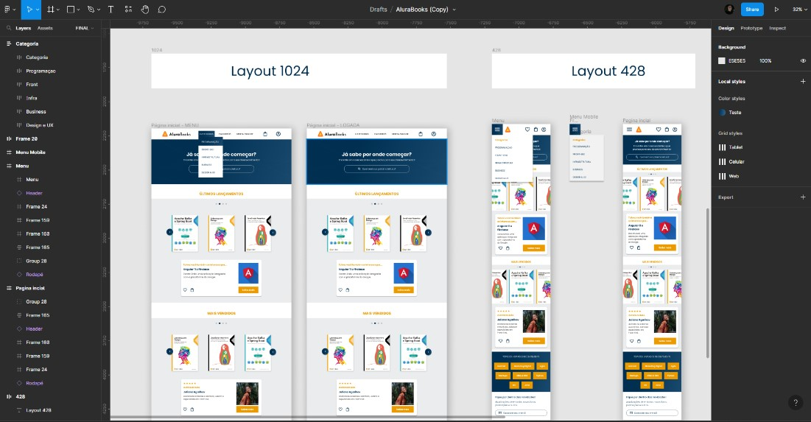

<h1 align="center">
    
</h1>

# Alura Books 📚

Projeto do curso de HTML e CSS: responsividade com mobile-first, ministrado pela Alura. Projeto desenvolvido seguindo as aulas e o modelo proposto pelo figma.

O web site, construído utilizando técnicas de responsividade para 3 tamanhos de tela com adição e subtração de elementos em cada dispositivo e conta também com dois carrosseis de imagens feitos com o auxilio da biblioteca Swiper.

## 💻 Recursos utilizados no projeto

✅ Figma; 
✅ Variáveis CSS; 
✅ Aplicação do reset.css; 

✅ @import; 
✅ Biblioteca Swiper 
✅ Google fonts; 

✅ Menu hambúrguer interativo; 
✅ Position relative e absolute; 
✅ FlexBox, flex-containers e flex-items; 

✅ Sections; 
✅ Edição de input e seu placeholder; 
✅ Media queries; 

✅ Diferentes estilos para diferentes tamanhos de tela; 
✅ Aplicação de elementos na tela de acordo com o tamanho do dispositivo; 
✅ Aplicação de diferente estilos com media queries diferentes; 
✅ Pseudo-classes. 
 
